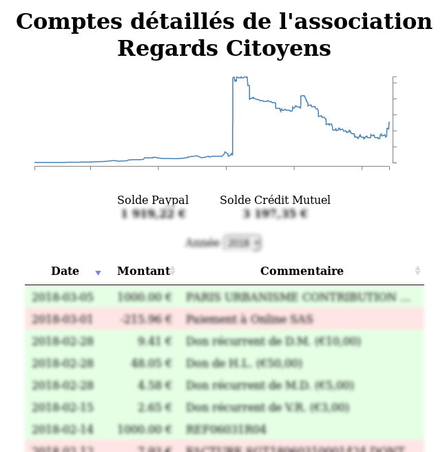

# Comptes détaillés de Regards Citoyens

Ce dépot publie les comptes détaillés de l'association [Regards Citoyens](http://regardscitoyens.org/) à partir de son relevé bancaire permanent et de son compte Paypal.

Le fichier [history.csv](https://github.com/regardscitoyens/banque/blob/master/data/history.csv) permet de connaitre les différentes opérations ayant été effectuées sur le compte depuis le 29 avril 2015.
Le fichier [list.csv](https://github.com/regardscitoyens/banque/blob/master/data/list.csv) contient le solde du compte.

L'export est réalisé grace aux plugins [creditmutuel](http://weboob.org/modules#mod_creditmutuel) et [paypal](http://weboob.org/modules#paypal) de [weboob](http://weboob.org/) et à [csvkit](http://csvkit.readthedocs.org/en/0.9.1/). Les informations sont mises à jour toutes les heures.

## Interface de visualisation



[Visualiser les données financières de l'association](https://regardscitoyens.github.io/banque/www/).

## Installation

```bash
# install dependencies
sudo apt-get -q install git python-pip spidermonkey-bin
sudo pip install -q virtualenv virtualenvwrapper
# run installer
bin/install.sh
```

## Exécution (attention autocommit)

```bash
bin/update_data.sh
```

## Install in crontab for autoupdates

To run automatically every hour for instance, add a line like this to your crontabs where $INSTALLPATH is the current repository:

` 00 * * * * $INSTALLPATH/bin/update_data.sh`

If your server uses Python2.6, you're likely to have issues with PayPal executing javascript which Python implementation is not 2.6-compatible.
A fallback workaround is to install [nodeJs](https://nodejs.org/), locate it (`which node` for instance) and add its PATH to the PATH used within crontabs as suchi (e.g. if node is installed in `/usr/bin`):

` 00 * * * * PATH=$PATH:/usr/bin $INSTALLPATH/bin/update_data.sh`

## Développement

- Exécution sans autocommit

```bash
bin/update_data.sh nocommit
```

- Utiliser les outils weboob

Weboob est installé dans le virtualenv `boobankRC`. Il faut donc l'activer:

```bash
# sourcing config.inc should do the trick
source config.inc
# ou avec virtualenvwrapper
source /usr/local/bin/virtualenvwrapper.sh
workon boobankRC
# Autrement d'ordinaire les envs sont installés dans $HOME/.virtualenvs
~/.virtualenvs/boobankRC/bin/activate
```

## Reset bank account logins
```bash
source config.inc
weboob-config add creditmutuel
weboob-config add paypal
```

## Désinstallation

```bash
bin/uninstall.sh
```

